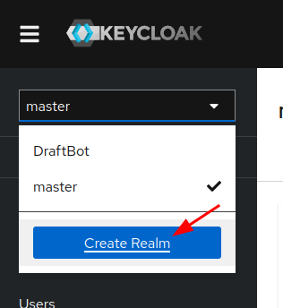
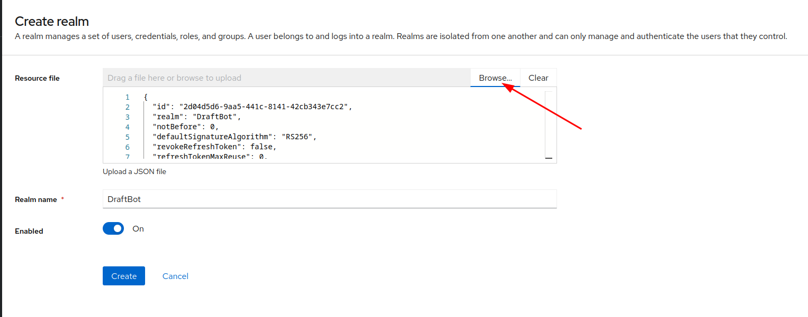
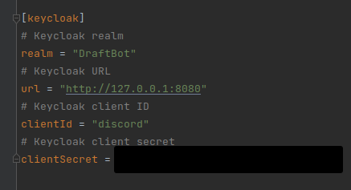

# Keycloak

Keycloak is the project used to authenticate users on Crownicles
## Setup the folder

Create the necessary folder for Keycloak data:
```sh
mkdir -p PROJECT_ROOT/keycloak/data/h2
```
### Linux 🐧  
You may need to adjust folder permissions to allow Keycloak to read and write the data:
```sh
chmod -R 755 PROJECT_ROOT/keycloak/data/h2 # May require sudo
```
If you still encounter permission issues, try:
```sh 
chmod -R 775 PROJECT_ROOT/keycloak/data/h2  # Less restrictive
```
## Start with docker

Before starting, **make sure** you are in the folder `src/keycloak/`.  

You can start Keycloak with docker using the following command:

```bash
docker-compose up -d
```

You can find the docker-compose file here:
[docker-compose.yml](./docker-compose.yml)

## Choosing the address Keycloak answers on

`KC_HOSTNAME` pins the address Keycloak puts in the tokens it issues and in the redirect URIs it
sends to the identity providers. Every client and service must therefore be able to reach Keycloak at
that exact address. For physical devices, use the stable mDNS hostname of the development Mac, not
the current Wi-Fi or hotspot IP. RestWs may still call Keycloak through `127.0.0.1` internally.

It defaults to `http://localhost:8080`, which is enough for the web build and the simulators. To let a
phone sign in, create your own file with the stable Mac hostname:

```bash
cp .env.example .env
```

and set `KEYCLOAK_HOSTNAME` to `http://<mac-name>.local:8080`. `.env` is gitignored because the
machine name depends on the developer, but it does not change when the Mac moves between networks.
After changing it, recreate Keycloak so the issuer is updated:

```bash
docker compose --env-file .env up -d --force-recreate keycloak
```

Note that the shipped realm has `sslRequired` set to `none`, because this whole setup serves plain
HTTP. Leaving the default `external` makes Keycloak reject requests as soon as it sees the client
address as public, which happens with some Docker networking setups even on a local machine. A real
deployment must raise it back and serve Keycloak over HTTPS.

## Configuring a realm

Visit http://127.0.0.1:8080/admin/master/console/ (Default credentials are admin/admin)

First click on the create realm button:



Import the already configured realm: [realm.json](realm.json):



Configure your Discord config.toml:

You will need to regenerate a client secret here on keycloak:

Manage -> Clients -> discord -> Credentials -> Client Secret -> Regenerate



## Logging in with Discord

The imported realm ships a `discord` identity provider, so Keycloak talks to Discord itself and the
front-ends only ever run a standard Authorization Code + PKCE flow against Keycloak. Adding another
way to sign in later is a matter of declaring one more provider here, with no change in the clients.

Two values are environment specific and are therefore left as placeholders in `realm.json`:

1. In *Identity providers -> Discord*, replace `TO_REPLACE_WITH_YOUR_DISCORD_CLIENT_ID` and
   `TO_REPLACE_WITH_YOUR_DISCORD_CLIENT_SECRET` with the credentials of your Discord application.
2. Copy the *Redirect URI* displayed on that same page and add it to the *Redirects* list of your
   application in the [Discord developer portal](https://discord.com/developers/applications). It is
   built from `KEYCLOAK_HOSTNAME`. Register the stable iOS/Wi-Fi/USB-tethering URI once:
   `http://<mac-name>.local:8080/realms/Crownicles/broker/discord/endpoint`.

   For Android USB mode, also register the loopback URI once because `adb reverse` exposes the Mac
   through the device's `127.0.0.1`:
   `http://127.0.0.1:8080/realms/Crownicles/broker/discord/endpoint`.

   These are two fixed development redirect URIs. Switching from home Wi-Fi to an iPhone hotspot
   does not require changing Discord, and the old IP-based fallback should be removed after the
   stable URI has been registered.

The provider uses the generic `oauth2` type because Discord is not an OpenID Connect provider: it
returns opaque tokens, so Keycloak reads the profile from `https://discord.com/api/users/@me`.

### Account matching

Accounts created by the Discord bot are named `discord-<discord id>`. The provider reproduces that
name through its *username* mapper, and its first login flow (`auto link first login`) links the
brokered login to that existing account instead of creating a second one. Changing either the mapper
template or the flow would cut existing players from their progress.