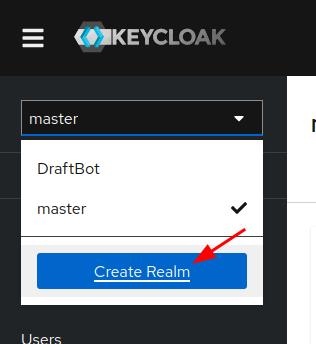
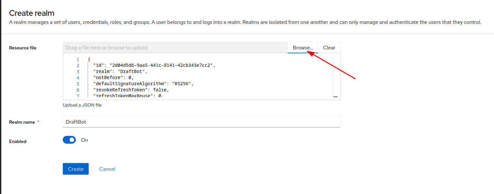
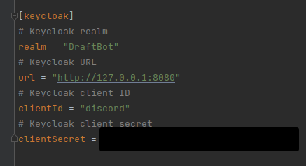

# Keycloak

Keycloak is the project used to authenticate users on Crownicles
## Setup the folder

Create the necessary folder for Keycloak data:
```sh
mkdir -p PROJECT_ROOT/keycloak/data/h2
```
### Linux 🐧  
You may need to adjust folder permissions to allow Keycloak to read and write the data:
```sh
chmod -R 755 PROJECT_ROOT/keycloak/data/h2 # May require sudo
```
If you still encounter permission issues, try:
```sh 
chmod -R 775 PROJECT_ROOT/keycloak/data/h2  # Less restrictive
```
## Start with docker

Before starting, **make sure** you are in the folder `src/keycloak/`.  

You can start Keycloak with docker using the following command:

```bash
docker-compose up -d
```

You can find the docker-compose file here:
[docker-compose.yml](./docker-compose.yml)

## Choosing the address Keycloak answers on

`KC_HOSTNAME` pins the address Keycloak puts in the tokens it issues and in the redirect URIs it
sends to the identity providers. Every client and service must therefore be able to reach Keycloak at
that exact address. For physical devices, use the stable mDNS hostname of the development Mac, not
the current Wi-Fi or hotspot IP. RestWs may still call Keycloak through `127.0.0.1` internally.

It defaults to `http://localhost:8080`, which is enough for the web build and the simulators. To let a
phone sign in, create your own file with the stable Mac hostname:

```bash
cp .env.example .env
```

and set `KEYCLOAK_HOSTNAME` to `http://<mac-name>.local:8080`. `.env` is gitignored because the
machine name depends on the developer, but it does not change when the Mac moves between networks.
After changing it, recreate Keycloak so the issuer is updated:

```bash
docker compose --env-file .env up -d --force-recreate keycloak
```

Note that the shipped realm has `sslRequired` set to `none`, because this whole setup serves plain
HTTP. Leaving the default `external` makes Keycloak reject requests as soon as it sees the client
address as public, which happens with some Docker networking setups even on a local machine. A real
deployment must raise it back and serve Keycloak over HTTPS.

## Configuring a realm

Visit http://127.0.0.1:8080/admin/master/console/ (Default credentials are admin/admin)

First click on the create realm button:



Import the already configured realm: [realm.json](realm.json):



Configure your Discord config.toml:

You will need to regenerate a client secret here on keycloak:

Manage -> Clients -> discord -> Credentials -> Client Secret -> Regenerate



## Logging in with Discord

The imported realm ships a `discord` identity provider, so Keycloak talks to Discord itself and the
front-ends only ever run a standard Authorization Code + PKCE flow against Keycloak. Adding another
way to sign in later is a matter of declaring one more provider here, with no change in the clients.

Two values are environment specific and are therefore left as placeholders in `realm.json`:

1. In *Identity providers -> Discord*, replace `TO_REPLACE_WITH_YOUR_DISCORD_CLIENT_ID` and
   `TO_REPLACE_WITH_YOUR_DISCORD_CLIENT_SECRET` with the credentials of your Discord application.
2. Copy the *Redirect URI* displayed on that same page and add it to the *Redirects* list of your
   application in the [Discord developer portal](https://discord.com/developers/applications). It is
   built from `KEYCLOAK_HOSTNAME`. Register the stable iOS/Wi-Fi/USB-tethering URI once:
   `http://<mac-name>.local:8080/realms/Crownicles/broker/discord/endpoint`.

   For Android USB mode, also register the loopback URI once because `adb reverse` exposes the Mac
   through the device's `127.0.0.1`:
   `http://127.0.0.1:8080/realms/Crownicles/broker/discord/endpoint`.

   These are two fixed development redirect URIs. Switching from home Wi-Fi to an iPhone hotspot
   does not require changing Discord, and the old IP-based fallback should be removed after the
   stable URI has been registered.

The provider uses the generic `oauth2` type because Discord is not an OpenID Connect provider: it
returns opaque tokens, so Keycloak reads the profile from `https://discord.com/api/users/@me`.

### Account matching

Accounts created by the Discord bot are named `discord-<discord id>`. The provider reproduces that
name through its *username* mapper, so a returning player is matched to the account that already
holds their progress instead of getting a second one. Changing the mapper template would cut
existing players from their progress.

The first login flow is the built-in `first broker login`. When the username already exists it asks
the player to confirm the link, then requires a proof of ownership through *Account verification
options*, which reads in priority order:

1. `idp-email-verification` — a mail is sent to the address already on the account;
2. *Verify Existing Account by Re-authentication* — **conditional**: `conditional-user-configured`
   skips it when the account carries no password to re-enter;
3. `idp-auto-link` — last resort.

The third step is what keeps the migration working. An account created by the bot has **neither an
address nor a password**: it has nothing to prove, and nothing an attacker could be given. Step 1
fails for lack of an address, step 2 is skipped for lack of a password, and the brokered identity is
attached. The Discord address then lands on the account through `emailClaim`, and from that point on
step 1 guards it.

Conversely an account that does carry credentials never reaches step 3, because a satisfied
conditional sub-flow is treated as required and takes precedence over the alternatives. This is what
closes the takeover path described in
[#4767](https://github.com/Crownicles/Crownicles/issues/4767): registering under someone else's
address no longer captures their Discord identity.

> The precedence of a satisfied `CONDITIONAL` sub-flow over its sibling `ALTERNATIVE` executions is
> the load-bearing assumption here. Replay both cases against a real Keycloak before deploying: a
> legacy `discord-<id>` account, and an account holding a password.

## Historical Discord Accounts and Email Collisions

The game owns progress by the Keycloak user ID, not by email. A bot-created user
named `discord-<id>` can have neither email nor federated identity. An unrelated
email registration can then win the first-broker-login email lookup before the
historical username is considered. Confirming ownership does not merge game data.

New bot accounts now include their Discord federated identity in the user creation
request. Existing accounts require an explicit backfill. Only users whose managed
`discordId` attribute matches their historical username are eligible. Existing
conflicting links are never removed or reassigned, and player rows are not updated.

This backfill only establishes the historical identity. It does not resolve a
collision by letting both accounts remain selectable. When the authenticated
Discord email is already owned by a distinct Crownicles account, the app stops
before opening the game and requires authentication of the second account. The
player then chooses one account and confirms removal of the other Keycloak user.
The losing account's game data stays retained under the existing deletion policy;
no progress, items or currencies are merged into the kept character.

Discord email and its verified flag are managed IdP attributes, not editable user
fields. The current provider is exposed through a session-note protocol mapper.
The resolver rechecks both accounts before deletion, persists the confirmed choice
on the kept identity and can resume it after an interruption. HTTP requests cannot
provide an arbitrary account ID to delete. The discarded WebSocket is closed and
unresolved collisions cannot open a game WebSocket.

Resolution is serialized in the RestWs process. Run one resolving RestWs instance;
multi-instance resolution needs a shared coordinator before horizontal scaling.
Do not run other administrative reassignment operations concurrently.

Keeping both accounts is a separate, intentional path: sign in to the email
account, change and verify its email first, then sign in through Discord once the
old address is free. Email change is tracked separately in
[#4892](https://github.com/Crownicles/Crownicles/issues/4892), not implemented here.

The Discord provider uses `IMPORT`, not `FORCE`: forcing the remote email onto an
already-linked historical user fails when another user owns that address. The
`gameUsername` mapper remains `FORCE`. `VERIFY_PROFILE` is explicitly disabled to
avoid retroactive email requirements on historical accounts. Email remains required
by the registration profile and `verifyEmail` stays enabled.

Deployment order:

1. Back up the realm and user data. Put login, registration and bot account creation
  into maintenance so identity ownership cannot change during the operation.
2. Apply the targeted provider and required-action changes to the deployed realm.
  Do not replace the live realm with this template: it contains placeholders and
  does not contain live users, keys or service-client configuration.
3. Compile Lib with `pnpm --dir Lib run tsc`. Provide `KEYCLOAK_URL`,
  `KEYCLOAK_REALM`, `KEYCLOAK_CLIENT_ID` and `KEYCLOAK_CLIENT_SECRET` through the
  operator's environment, using a service account with query/view/manage-users.
4. Run `node keycloak/scripts/linkLegacyDiscordAccounts.mjs` for a read-only audit.
  Resolve every conflict manually before applying. Never use email alone as proof
  that two game accounts should be merged.
5. Run the same command with `--apply`, then repeat the read-only audit. Conflicts
  produce a nonzero exit code; repeated successful links are no-ops.
6. Test a historical player and a distinct email account before leaving maintenance.

The reproducible laboratory test is
`node --test keycloak/tests/discord-identity.integration.test.mjs`, after compiling
Lib and RestWs and installing App dependencies for its existing DOM/cookie parsers. It expects
an isolated Keycloak 26.7.4 on `127.0.0.1:18180` with the synthetic bootstrap account
`proof-admin` / `local-proof-only-password`. It only recreates the dedicated
`crownicles-discord-identity-proof` realm and uses a synthetic OAuth provider on
port 18181; it must not run against a shared or deployed Keycloak. It proves the
broker/token identity, conflict refusal, backfill behavior, both choices with real
PKCE tokens, losing-identity deletion, subsequent Discord login, and registration
email constraints; not a live Discord consent screen or mail delivery.

## Sending mail

Opening the Crownicles account ([#4768](https://github.com/Crownicles/Crownicles/issues/4768)) makes
SMTP a production dependency: without it there is neither address verification nor password reset,
so nobody can finish signing up.

The realm ships **Brevo** on its free tier: **300 mails a day**, no card, no expiry, and an SMTP
relay included. It was picked over Mailjet (200/day), SMTP2GO (1 000/month), Resend (3 000/month),
MailerSend and Scaleway (both ask for a card). Fastmail was ruled out on purpose — its terms forbid
transactional mail and allow immediate suspension.

The sender is `contact@crownicles.com`, on the `crownicles.com` domain authenticated at Brevo, so
SPF and DKIM are signed and the verification mails are not treated as spam. It is already set in
`realm.json`. Two values remain environment specific and are left as placeholders:

| Placeholder | Where to find it |
| --- | --- |
| `TO_REPLACE_WITH_YOUR_BREVO_SMTP_LOGIN` | the *SMTP & API* page — either the account address or `<id>@smtp-brevo.com` |
| `TO_REPLACE_WITH_YOUR_BREVO_SMTP_KEY` | an **SMTP key** generated on that same page |

Set them in *Realm settings → Email*, never in the versioned file. Watch out for three traps:

- the password is an **SMTP key**, not an API key — the two look alike and only one authenticates the
  relay;
- the account filters on **[authorised IPs](https://app.brevo.com/security/authorised_ips)**. Every
  machine that sends — a developer laptop as much as the production host — has to be listed there,
  otherwise Brevo answers `401 unauthorized` with an `unrecognised IP address` message and no mail
  leaves. Home connections usually have a rotating address, so expect to add it again;
- a Brevo account must be **approved for sending** before the first mail leaves, and approval is
  manual. Do it well before opening registration, not on launch day.

Brevo **blocks** at the daily quota, it does not overflow into paid usage. The app has to cope with a
mail that will not arrive, and an alert on the daily count gives the warning needed to switch relays
by hand — Scaleway Transactional Email being the fallback, at €0.25 per 1 000 after the first 300.

## Looking like the game

The player leaves the app to sign in, so the pages and the mails they land on are part of the game's
surface, not a separate website. The realm points `loginTheme` and `emailTheme` at **`crownicles`**,
a theme living in `keycloak/theme` and mounted into the container as a single theme — mounting over
`/opt/keycloak/themes` would hide the built-in ones it inherits from.

It carries a single template of its own. `login` inherits from `keycloak` and adds one stylesheet that
restates the tokens of `App/src/design/Theme.ts`: white paper, ink text, pill buttons, no relief.
It overrides `login-verify-email.ftl` only: the mail link is usually opened in the mail app, so the
page resumes the sign-up when the player comes back to it (`js/crownicles.js`), and tells them where
it went on when the link was opened in another browser, which takes the flow over.
`email` inherits from `base` and replaces the layout and the wordings, in French and in English.

Three things to know before editing it:

- **PatternFly draws borders in `::before` and `::after` layers.** Overriding `border` on the element
  leaves a second, misaligned frame that no amount of specificity removes. The pseudo-elements have
  to be hidden.
- **Mail styling has to be inline.** Clients strip `<style>` blocks, so a stylesheet would leave the
  message unstyled exactly where it matters.
- **`start-dev` reloads the theme on every request, but the browser does not.** Keycloak serves its
  resources with a long `Cache-Control`, so a plain reload keeps the old CSS. Force it, or check what
  is actually served with `curl`.

Pages and mails follow the player's language: the realm declares the game's six locales and defaults
to French, and the app passes `ui_locales` on every authorisation request. Mails are the exception —
they are sent outside of any request, so Keycloak reads the user's `locale` attribute. Accounts
created by the Discord bot carry `language` instead, so their mails fall back to French until the
two are reconciled.

Inter is served by the theme itself, in `login/resources/fonts`. A remote stylesheet on a sign-in
page would hand a third party the address of every player who signs in, and would turn any
compromise of that host into arbitrary CSS on the page where passwords are typed — CSS is enough to
exfiltrate what is being typed, through attribute selectors and background images.

## Hardening

A few settings in `realm.json` are deliberate and easy to undo by accident:

- **`sslRequired` is `external`**, which is what production needs. Locally Keycloak sometimes sees a
  public client address — a VPN, or Docker's own NAT — and then answers `HTTPS required` to
  everything. The fix is to lower the *running* realm, never the file:
  `kcadm.sh update realms/Crownicles -s sslRequired=NONE`.
- **Sign-up is Keycloak's own page, with `verifyEmail` on.** The app opens it with `prompt=create`.
  It asks for a username and an address only: with `verifyEmail` on, Keycloak leaves the password
  out of the form and asks for it through `UPDATE_PASSWORD` once the address is confirmed, in the
  same browser session. Nobody can therefore hold a usable account on an address they do not own,
  and the player comes back to the app signed in. `accessCodeLifespanUserAction` and the
  `verify-email` action token last 15 minutes, so reading the mail does not time the flow out.
- **RestWs reviews every sign-up** (`RegistrationHygiene`), since the page offers no hook of its
  own. It reads the `REGISTER` events — the only type the realm stores, for a day — and, for the
  accounts created by the form, deletes those named `discord-…` (the name the bot gives the
  account of a Discord player, which a squatter would otherwise take from them) or after a
  reserved name, deletes those still unconfirmed after an hour, and copies the username as typed
  into `gameUsername`: Keycloak lowercases the username, the event keeps the player's case. The
  `restWs` service account needs `view-events` and `manage-users` on `realm-management`.
  `registrationEmailAsUsername` would have closed the `discord-` names at the root, but Keycloak
  then requires an address **through the Admin API too**, and the Discord bot creates its accounts
  without one. It fails with `error-user-attribute-required`.
- **Unmanaged attributes are `ADMIN_EDIT`.** `discordId`, `gameUsername` and `language` are not
  declared in the user profile, so only the Admin API writes them. Under `ENABLED` a player could
  set their own `discordId` — from the account console, or by adding a field to the sign-up
  form — and be taken for another player by the bot. ⚠️ Importing `realm.json` resets the policy
  to `ENABLED`: the file declares Keycloak 22, and the migration to 24 enables unmanaged attributes
  to preserve the behaviour of the time. Set it back after every import, in *Realm settings → User
  profile → Unmanaged attributes*.
- **The account console is off.** The `account-console` client is disabled and the default roles
  no longer grant `manage-account` nor `view-profile`. The app covers what it offered: the account
  deletion goes through RestWs, and a forgotten password through the sign-in page.
- **Attribute updates send the whole account back.** A partial `PUT` on a user makes Keycloak erase
  what it omits, the address included, which locks a player out of their password reset.
- **`passwordPolicy` requires 10 characters** and refuses the username or the address as a password.
  Without it any password is accepted, including a single letter, which matters as soon as accounts
  are not brokered any more.
- **`failureFactor` is 10**, down from the Keycloak default of 30.
- **No client accepts direct access grants.** The password grant is gone from OAuth 2.1, and it was
  only ever used by two RestWs routes, `/login` and `/refreshToken`, that the app never called — it
  talks to Keycloak directly with PKCE. Both routes are removed, along with `KeycloakUtils.loginUser`
  and `refreshUserToken`. The admin API keeps working: it was already using `client_credentials`
  through the service accounts of `discord` and `restWs`.
- **`crownicles-app` only accepts its own redirect URI.** A custom scheme is not exclusive — another
  application can register `crownicles://` and catch the code — so the wildcard was narrowed to the
  `auth` path. PKCE already makes a stolen code useless, but there is no reason to hand it out.
- **The image is pinned** to an exact version. An authentication server on `latest` upgrades
  silently, and nothing tells which advisories apply to what is actually running.

Two traps met while upgrading:

- **Commands other than `start` refuse to migrate the schema.** `export` fails with `Database not
  up-to-date` after an image bump; start the server once, then export.
- **`registration-profile-action` no longer exists** since the declarative User Profile replaced it.
  A realm still declaring it breaks registration with a `NullPointerException`, and the flow becomes
  unreadable through the API — `GET authentication/flows/registration/executions` answers 404 while
  the same call works for `browser`. Only a re-import fixes it.


